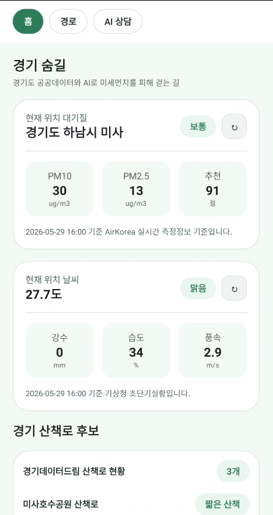

# 경기 숨길

<p align="center">
  
</p>

공공데이터와 AI를 활용해 현재 위치의 대기질과 날씨를 확인하고, 사용자가 더 안전하게 산책할 수 있도록 돕는 Android 앱입니다.

## 프로젝트 개요

경기 숨길은 경기도민이 미세먼지와 날씨를 쉽게 이해하고 산책 여부를 판단할 수 있도록 만든 생활 밀착형 모바일 서비스입니다. 사용자는 현재 위치의 PM10, PM2.5, 날씨 상태를 확인하고, 지도 기반 산책 후보와 AI 상담을 통해 오늘 산책해도 괜찮은지 질문할 수 있습니다.

단순 길찾기 앱이 아니라 대기질, 날씨, 위치, 산책 후보를 함께 고려해 외출과 산책 의사결정을 돕는 것을 목표로 합니다.

## 화면 미리보기

<p align="center">
  
</p>

홈 화면에서는 현재 위치의 대기질, 날씨, 산책 후보를 한 번에 확인할 수 있습니다.

## 주요 기능

- 현재 위치 기반 대기질 조회
- 현재 위치 기반 날씨 조회
- Naver Map 기반 지도 표시
- Tmap 보행 경로 API 기반 산책 경로 후보 생성
- 공공 산책로 후보 표시
- Gemini 기반 AI 대기질 상담
- 자연어 질문 기반 산책 후보 추천
- 대기질과 날씨를 반영한 산책 점수 표시

## 활용 데이터 및 API

### 공공데이터

- 공공데이터포털 AirKorea 대기오염정보 조회 서비스
  - PM10, PM2.5 등 실시간 대기질 정보 조회
- 공공데이터포털 기상청 초단기실황 및 초단기예보 조회 서비스
  - 현재 위치의 하늘상태, 강수형태, 기온 등 날씨 정보 조회
- 경기도 및 수도권 산책로, 공원, 수변 공간 관련 공개 데이터
  - 앱 내 산책 후보 추천 기준으로 활용

### 지도 및 AI

- Naver Map SDK
  - 지도 표시 및 위치 기반 UI 구성
- Tmap 보행 경로 API
  - 보행 경로 후보 생성
- Gemini API
  - 대기질·날씨 기반 AI 상담
  - 산책 요청 문장 분류 및 장소 판단 보조
  - Google Maps Grounding을 활용한 장소 인식 보강

## 기술 스택

- Kotlin
- Android Jetpack Compose
- Naver Map SDK
- OkHttp
- Gson
- Kotlin Coroutines
- JUnit

## 앱 구조

```text
app/src/main/java/com/gyeonggisumgil/app
├── data
│   ├── ai          # AI 산책 요청 분류 및 산책 후보 로직
│   ├── airkorea    # AirKorea 대기질 API 연동
│   ├── gemini      # Gemini API 연동
│   ├── tmap        # Tmap 장소 검색 및 보행 경로 API 연동
│   ├── walking     # 산책로 후보 데이터
│   └── weather     # 기상청 날씨 API 연동
├── domain          # 공통 도메인 모델
└── ui              # Jetpack Compose 화면 구성
```

## 실행 방법

### 1. 저장소 클론

```bash
git clone https://github.com/prisma77/Gyeonggi-Sumgil.git
cd Gyeonggi-Sumgil
```

### 2. API 키 설정

프로젝트 루트의 `local.properties`에 다음 값을 설정합니다.

```properties
NAVER_CLIENT_ID=네이버지도_클라이언트_ID
TMAP_APP_KEY=Tmap_APP_KEY
AIRKOREA_SERVICE_KEY=AirKorea_인증키
KMA_SERVICE_KEY=기상청_인증키
GEMINI_API_KEY=Gemini_API_KEY
```

`local.properties`는 개인 API 키를 포함하므로 Git에 커밋하지 않습니다.

### 3. 빌드

```bash
./gradlew assembleDebug
```

Windows PowerShell에서는 다음 명령을 사용할 수 있습니다.

```powershell
.\gradlew.bat assembleDebug
```

### 4. 테스트

```powershell
.\gradlew.bat test
```

## 현재 구현 상태

- Android 실제 기기에서 지도, 대기질, 날씨, AI 상담 기능 테스트
- 현재 위치 기반 AirKorea 측정소 매칭 구현
- 기상청 초단기 날씨 조회 구현
- Tmap 보행 경로 기반 산책 후보 생성 구현
- 일반적인 "산책길 추천" 요청을 현재 위치 기반 추천으로 처리
- AI 응답이 실제 앱 경로 계산 결과를 과장하지 않도록 분리

## 한계 및 개선 방향

- 보행 경로 품질은 외부 지도 API의 산책로 선형 데이터에 영향을 받습니다.
- 하천길, 호수 둘레길 등은 지도 API별 보행 데이터 차이가 있어 실제 산책 전 지도 확인이 필요합니다.
- 향후 경기데이터드림의 공원, 산책로, 생활환경 데이터를 추가 연계해 경기도 지역성을 강화할 계획입니다.
- 산책 후보 추천 점수에 대기질, 날씨, 거리, 도로 인접도 등을 더 정교하게 반영할 예정입니다.

## 경진대회 포지셔닝

경기 숨길은 공공데이터를 단순 조회하는 앱이 아니라, 대기질과 날씨 데이터를 AI 상담 및 지도 기반 산책 추천으로 연결하는 서비스입니다. 경기도민의 일상적인 산책과 외출 의사결정에 공공데이터를 활용한다는 점에서 생활 환경·건강 분야의 공공데이터 활용 사례를 목표로 합니다.
